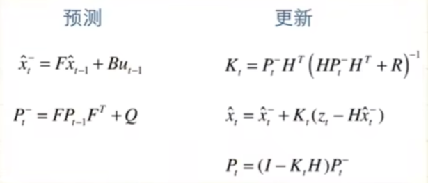

# 第三题：卡尔曼滤波器

## 一、基础部分学习方法
与第二题类似

## 二、卡尔曼滤波器学习过程及感想

1. B站看了[@华南小虎队](https://www.bilibili.com/video/BV1Rh41117MT?p=5&vd_source=25214389306df924fff60ffae7884ece)的视频，从原理解析到公式推理再到实际应用讲得挺清晰

2. 对于本题4个状态量2个观测量还带有过程噪声和观测噪声，我们首先就会想到卡尔曼滤波器，至于为何不用高、低通滤波器等传统滤波器，则是因为这些噪声分布于各个频段，偏向于白噪声，传统滤波器难以过滤完全，而且卡尔曼滤波器设计思想专门考虑到了过程及观测噪声

3. 卡尔曼滤波器基本公式：
   

4. 卡尔曼滤波器专注于处理线性高斯系统，擅长处理白噪声，利用统计学思想，噪声的高斯分布（正态分布）特性优化，拿到本题这样一个系统，我们首先明确各类迭代量：
   - x, y初始实际位置及速度
   - x, y位置、速度信息过程噪声Q、观测噪声协方差矩阵R、误差协方差矩阵P
   - x, y位置及速度的先验值、观测值及最优解

5. 具体过程：
   1. 由t-1时刻最优解去预测t时刻x, y的位置及速度的先验值
   2. 由t-1时刻的误差协方差矩阵P(t-1|t-1)得到t时刻先验协方差矩阵P(t|t-1)
   3. 明确观测值z(t) = x(t) + v(t)（其中z为观测值，x为仅考虑过程噪声的先验值，v为观测噪声）
   4. 更新卡尔曼增益系数Kt
   5. 由Kt得出t时刻最优估计解（由先验值和观测值加权求和）
   6. 最后更新先验误差协方差矩阵P(t|t-1)得到t时刻误差协方差矩阵P(t|t)，以便下次循环迭代

6. 利用卡尔曼滤波最重要的是调超参Q, R，因为它们决定了观测量和理论先验量的权重，影响最优估计值，由于δt = 10ms并不是极小的，因此实际信号会是f = 100Hz的阶梯状信号与噪声不规则锯齿信号的叠加态，利用卡尔曼滤波能够让信号更平滑

7. 最后跑出来可以明显看到经过滤波器后的分布与观测的离散点相比更加靠拢真实值